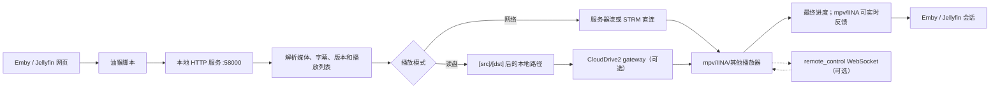

# embyToLocalPlayer 功能与维护参考

本文以当前 `beta` 分支的代码、`embyToLocalPlayer_config.ini` 和 `user_script/embyToLocalPlayer.user.js` 为准，服务维护、排错和小范围改动。安装步骤看 [README.md](README.md)；不要把上游 README 或其他分支的历史功能当作本分支承诺。

## 开源许可与致谢

本项目遵循根目录 [Apache License, Version 2.0](LICENSE)。本仓库基于并跟踪上游 [kjtsune/embyToLocalPlayer](https://github.com/kjtsune/embyToLocalPlayer)，感谢上游作者 **kjtsune** 及所有贡献者；再分发修改版本时，应保留许可证、版权和归属声明，并标注修改内容。

## 1. 分支边界

| 项目 | 当前 `beta` 的结论 |
| --- | --- |
| 上游关系 | 仓库为 [hope140/embyToLocalPlayer](https://github.com/hope140/embyToLocalPlayer) 的 `beta`，基于并跟踪 [kjtsune/embyToLocalPlayer](https://github.com/kjtsune/embyToLocalPlayer)，但按本分支代码独立维护。 |
| CloudDrive2 | `[clouddrive2]` 启用后，使用本地 CloudDrive2 gRPC API、`path_map` 和 ETLP 短期本地 gateway 解析 STRM；可选请求 `directUrl`；失败回退 `downloadUrlPath` 或原挂载文件。 |
| 独立远程控制 | `[remote_control]` 为当前 mpv/IINA 建立独立 Emby 会话控制通道，支持暂停/继续、seek、停止和消息显示；只作用于当前机器。 |
| 实时反馈 | `[dev] playing_feedback_*` 面向 mpv/IINA 回传播放位置和暂停状态；最终回传仍由 `[emby] update_progress` 控制。 |
| 明确排除 | 本项目不实现同步观看房间；该能力请使用独立项目 [EmbyWatchTogether](https://github.com/hope140/EmbyWatchTogether)。同时不对豆瓣/Bangumi、Simkl/Trakt、聚合搜索、qBittorrent 联动等旁线能力提供支持承诺。 |

## 2. 运行链路

| 组件 | 主要职责 | 代码入口 |
| --- | --- | --- |
| 浏览器脚本 | 拦截播放请求、切换网页/本地模式、读取媒体信息、增强页面 | `user_script/embyToLocalPlayer.user.js` |
| Python 入口 | 读取配置、清理临时状态、启动后台任务和本地服务 | `embyToLocalPlayer.py` |
| HTTP 服务 | 接收脚本请求，分派播放、文件夹、缓存、STRM gateway 等动作 | `utils/http_server.py` |
| 数据解析 | 处理 Emby/Jellyfin/Plex 响应、版本、字幕、STRM 和播放列表 | `utils/data_parser.py` |
| 播放器管理 | 启动播放器、维护连续播放、获取位置和暂停状态 | `utils/player_manager.py`、`utils/players.py` |
| 服务端会话 | 最终/实时进度回传、Emby 会话和控制能力声明 | `utils/net_tools.py`、`utils/emby_session_api.py`、`utils/remote_control_client.py` |
| CloudDrive2 | 路径映射、gRPC URL 解析、短期本地 gateway | `utils/clouddrive2_client.py`、`utils/clouddrive2_gateway.py` |
| 配置与通用工具 | INI、播放器别名、日志、路径和进程处理 | `utils/configs.py`、`utils/tools.py` |

## 3. 支持矩阵与实现边界

### 媒体服务

| 能力 | Emby | Jellyfin | Plex | 边界 |
| --- | --- | --- | --- | --- |
| 网页调用外部播放器 | 支持 | 支持 | 保留兼容逻辑 | 依赖页面结构和接口版本。 |
| 网络播放 | 支持 | 支持 | 兼容 | 域名、代理、播放器和服务器响应都会影响结果。 |
| 读取硬盘/路径转换 | 支持 | 支持 | 条件 | 客户端必须能访问转换后的路径。 |
| `.strm` 直连/本地定位 | 支持 | 支持 | 依实现路径 | 直连要求播放器可访问内部 URL；本地定位依赖路径和后缀规则。 |
| 连续播放/多集回传 | 支持 | 支持 | 兼容 | 多版本、外挂字幕和播放器列表 API 可能限制下一集。 |
| 播放器退出后的最终进度 | 支持 | 支持 | 兼容 | `[emby] update_progress` 可关闭；特殊媒体格式仍可能没有可回传位置。 |
| 实时进度和暂停状态 | 支持 | 支持 | 未作为 Plex 实时能力承诺 | 当前实现围绕 mpv/IINA 的 IPC 和 Emby/Jellyfin 会话。 |

### 播放器

| 播放器 | 基础播放 | 连续播放 | 进度回传 | 维护注意 |
| --- | --- | --- | --- | --- |
| mpv | 支持 | 支持 | 实时 + 最终 | 实时反馈、IPC、预热等高级路径主要围绕 mpv。 |
| IINA | 支持 | 支持 | 实时 + 最终 | 依赖 macOS IINA CLI/IPC 配置和 Emby 会话识别。 |
| mpv.net | 支持 | 支持 | 条件 | 视启动方式和 IPC 兼容情况而定。 |
| PotPlayer / MPC-HC / MPC-BE / VLC | 支持 | 条件 | 主要为最终 | 网络播放、外挂字幕和播放列表接口存在播放器差异。 |

## 4. 配置速查

| 区域 | 关键字段 | 用途 |
| --- | --- | --- |
| `[exe]` | `mpv`、`iina`、`pot` 等 | 播放器可执行文件路径和别名。 |
| `[emby]` | `player`、`update_progress`、`fullscreen` | 默认播放器、最终进度回传、自动全屏。 |
| `[src]` / `[dst]` | 同名前缀键 | 把服务端显示路径映射为本地或挂载路径；按配置顺序匹配。 |
| `[clouddrive2]` | `enable`、`origin`、`api_token`、`path_map`、`request_timeout_seconds`、`get_direct_url` | CloudDrive2 gRPC 和 STRM gateway。Windows/UNC 路径必须有明确 `path_map`；直链开关默认关闭。 |
| `[playlist]` | `enable_host`、`version_filter`、`item_limit`、`http_sub_auto_next_ep` | 连续播放范围、版本匹配、条数限制和简易自动下一集。 |
| `[dev]` | `listen_on_localhost`、`http_server_token`、`strm_*`、`playing_feedback_*`、`force_disk_mode_path` | 本地 HTTP 安全、STRM、本地预热、实时反馈、代理、日志和高级播放策略。 |
| `[remote_control]` | `enable` | 当前 mpv/IINA 的 Emby 控制 WebSocket；默认 `yes`。 |

浏览器脚本的 `webPlayerEnable`、`mountDiskEnable`、继续观看排序/隐藏等状态保存在油猴本地存储，不属于 INI；修改网页端行为时要同时检查脚本和 Python 入口收到的字段。

### CloudDrive2 维护约束

- `origin` 默认是 `http://127.0.0.1:19798`，指向 CloudDrive2 本机 API，不是 Emby 登录地址。
- token 优先从 `ETLP_CLOUDDRIVE2_TOKEN` 读取；配置文件中的 `api_token` 只能作为回退来源，禁止提交真实 token。
- `path_map` 使用 `本地前缀=>云端前缀`，例如 `X:\115=>/115open/115`。没有 token、映射或可用 gRPC 时，gateway 不会登记路径。
- `get_direct_url` 默认关闭。开启后只有 CloudDrive2 返回有效 `directUrl` 时才走本地直链代理；`expiresIn`、`userAgent` 和 `additionalHeaders` 只用于当前请求，不能写入日志。
- 开启 `get_direct_url` 后，若映射云盘支持直链但 `supportDirectLink` 未开启，ETLP 会通过
  `GetCloudAPIConfig`/`SetCloudAPIConfig` 自动开启并回读确认。CD2 Token 需要
  `allow_get_cloud_apis`、`allow_modify_cloud_apis`，账户/云盘还需具备
  `enable_direct_link` 角色或会员资格；失败时保持普通回退链路。
- gateway URL 只暴露随机 nonce；本地路径、CloudDrive2 凭据和直链签名留在进程内存。直链代理失败先回退 `downloadUrlPath`，解析失败再走原挂载文件回退路径。
- 不要把 gateway 或本地 HTTP 服务配置为公网媒体服务；其设计目标是本机播放和受控的局部接口。

## 5. 代码导航

| 修改目标 | 先看配置/前端开关 | 主要模块 | 必测范围 |
| --- | --- | --- | --- |
| 播放器启动或参数 | `[exe]`、`[emby] player`、`player_by_path` | `utils/tools.py`、`utils/players.py` | 启动、开始时间、字幕、停止、连续播放。 |
| 网页播放按钮/模式 | `webPlayerEnable`、`mountDiskEnable` | `user_script/embyToLocalPlayer.user.js` | 首页、详情页、列表和直播边界。 |
| 路径转换/读盘 | `[src]`、`[dst]`、`force_disk_mode_path`、`path_check` | `utils/tools.py`、`utils/data_parser.py` | Windows、Linux/macOS、特殊字符、STRM。 |
| STRM 本地定位/预热 | `strm_direct_host`、`strm_local_*` | `utils/data_parser.py`、`utils/net_tools.py`、`utils/clouddrive2_*` | URL path、后缀、冷挂载、字幕缓存、CloudDrive2 回退。 |
| 版本/字幕策略 | `version_prefer`、`version_filter`、`subtitle_priority` | `utils/data_parser.py`、`utils/players.py` | 首页播放、手选版本、下一集、内封/外挂字幕。 |
| 连续播放 | `[playlist]` | `utils/player_manager.py`、`utils/data_parser.py`、`utils/players.py` | 单集、列表、多版本、S0、HTTP 外挂字幕。 |
| 实时反馈 | `playing_feedback_*` | `utils/player_manager.py`、`utils/net_tools.py`、`utils/emby_session_api.py` | mpv/IINA、暂停/恢复、间隔、服务器过滤。 |
| 独立远程控制 | `[remote_control] enable` | `utils/remote_control_client.py`、`utils/emby_session_api.py` | 会话绑定、能力声明、Pause/Seek/Stop/Message、断线回退。 |
| HTTP 安全 | `listen_on_localhost`、`http_server_token` | `utils/http_server.py`、`utils/http_security.py` | 回环默认、非回环 token、Bearer、媒体签名 URL。 |

## 6. 安全约束与已知边界

- 本地 HTTP 默认只监听回环地址。只有确有跨设备需求时才设置 `[dev] listen_on_localhost = no`，并配置至少 32 个字符的随机 `http_server_token`。
- 油猴脚本和 Python 内部请求使用 `X-ETLP-Protocol: 1`；非回环动作接口使用 `Authorization: Bearer`，且只开放代码明确允许的稀疏文件和 STRM 临时进度动作，不能据此推断为通用远程 API。
- 媒体转发使用带 `file_path`、`expires`、`sig` 的短期 HMAC URL；不要在 URL、日志、截图或提交中暴露 token、Cookie 或完整敏感路径。
- `mix_log = yes` 应保持开启以模糊日志中的域名及密钥；排错时只提供必要片段。
- 远程控制是当前播放器的独立会话通道，不是同步观看系统；修改它时不得引入房间状态、参与者状态或跨设备跟随语义。
- 修改播放流程至少回归：网络模式、读取硬盘模式、单集、播放列表、`.strm`、CloudDrive2 失败回退和播放器退出后的最终进度。
- 修改实时反馈时要分别验证实时反馈、暂停/恢复、会话识别和退出后的最终回传，不能用其中一种结果替代另一种。
- 新增播放器不能只验证“能启动”，还要记录其开始时间、字幕、连续播放、最终进度和实时反馈支持情况。
- 同步观看房间不属于当前 `beta` 的实现范围；需要房间、参与者管理和跨设备跟随播放时，请使用独立项目 [EmbyWatchTogether](https://github.com/hope140/EmbyWatchTogether)。豆瓣/Bangumi、Simkl/Trakt、聚合搜索、qBittorrent 等旁线文案也不属于当前 `beta` 验收依据；若代码重新引入相关能力，应另行设计范围和测试。

## 7. 维护文档与 Knowledge Review

- 当前模块边界和数据流见 [`docs/architecture.md`](docs/architecture.md)。它只描述当前代码已实现的结构，不记录计划中的功能。
- 已验证、可复用的排错经验见 [`docs/lessons-learned.md`](docs/lessons-learned.md)。一次性任务日志、未复现推测和未决风险不直接写入经验库。
- 跨模块且长期有效的取舍见 [`docs/adr/README.md`](docs/adr/README.md) 及其 ADR 文件；创建前先搜索是否已有相同决策。
- 任务结束复盘使用 [`docs/knowledge-review-template.md`](docs/knowledge-review-template.md)。实质性代码、Bug、架构或兼容性任务必须在报告中给出 `Knowledge Findings`；无新增内容时明确写“无”。
