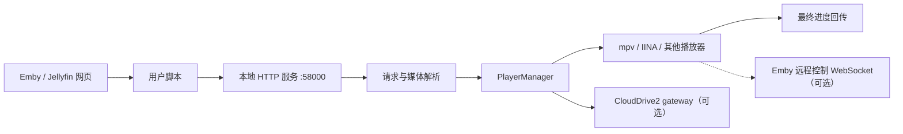

# 当前架构

本文只描述当前 ETLP checkout 分支代码已实现的结构和边界。功能细节、支持矩阵和
配置说明见 [`FUNCTIONS.md`](../FUNCTIONS.md) 与 [`README.md`](../README.md)；稳定的
跨模块取舍见 [`adr/README.md`](adr/README.md)。架构变化完成验证后，应先更新本文，
再判断是否需要新增或更新 ADR。

## 运行时边界

ETLP 是一个本地 Python 播放辅助服务：浏览器用户脚本向本机 HTTP 服务发送播放
请求，服务解析媒体和播放列表数据，选择播放器并管理本地播放；可选能力通过独立
的 CloudDrive2 gateway、Emby 会话回传和远程控制通道扩展。它不是公网媒体服务，
也不包含同步观看房间。

## 组件与职责

| 组件 | 主要职责 | 代码入口 |
| --- | --- | --- |
| 进程入口 | 加载 bundled dependencies、取得 ETLP 实例锁、读取配置、清理临时状态、启动后台任务和 HTTP 服务 | `embyToLocalPlayer.py`、`utils/instance_lock.py` |
| 本地 HTTP 服务 | 精确路由、协议头/令牌校验、请求体解析、单播放占用、播放/文件/缓存动作分派和短期媒体 URL | `utils/http_server.py`、`utils/http_security.py` |
| 数据解析 | 处理 Emby/Jellyfin/Plex 响应、路径、STRM、版本、字幕和播放列表数据 | `utils/data_parser.py` |
| 播放管理 | 启动播放器、连续播放、预热、播放状态读取和最终进度更新 | `utils/player_manager.py`、`utils/players.py` |
| Emby 会话与远程控制 | 为当前播放建立独立控制身份，进行 HTTP/WebSocket 回传和控制命令处理 | `utils/emby_session_api.py`、`utils/remote_control_client.py` |
| CloudDrive2 | 将明确映射的本地 STRM 路径短期登记为 opaque gateway URL，失败时回退本地路径 | `utils/clouddrive2_client.py`、`utils/clouddrive2_gateway.py` |
| 更新与配置比较 | 按当前频道选择对应 ZIP 与 sidecar，保护本地配置、安全解压示例配置并输出语义差异 | `utils/update.py`、`utils/config_diff.py` |

## 当前跨组件约束

1. 本地 HTTP 默认只监听回环地址；非回环绑定需要强 token，动作接口和媒体 URL
   不能扩大为通用公网 API。
2. Emby/Plex 请求必须先解析为完整播放数据，再创建后台播放线程；解析失败不能
   伪装成已成功分派。
3. 远程控制是当前播放器的可选能力。WebSocket 依赖、网络、会话和命令失败时，
   应降级为无远程控制，不破坏普通播放和退出时的最终进度回传。
4. 控制命令必须绑定当前播放 session、控制设备和用户上下文；状态回传中的 Item/
   MediaSource 要跟随当前播放项目，旧 session 的命令不能被新播放确认。
5. STRM 本地预热和 CloudDrive2 解析均是 best-effort：超时或不可用时保留原有
   路径判断和回退路径，不能阻塞播放启动。
6. ETLP 启动前取得基于操作系统的跨进程实例锁；第二个 ETLP 进程直接退出，残留锁文件
   本身不代表活动实例。启动阶段不按进程名清理外部播放器，未知端口占用者不得被终止。
   播放路由使用进程内 playback lease 同时只接纳一个活动播放器；第二个播放请求返回
   `409 playback_busy`，lease 保持到托管播放器结束或直接 `Popen` 进程退出。
7. `stable` 是默认分支，`beta` 是测试分支，`main` 只同步上游。打包脚本要求当前
   分支与频道一致；更新器按安装包内的频道先从 GitCode Releases API 选择同时包含对应
   ZIP 与 SHA-256 sidecar 的已发布 tag，GitCode API、附件下载或校验失败时才回退 GitHub
   Releases API，并对 GitHub 结果完整重复校验，不使用跨频道的 `Latest` 资产。GitCode
   Release 附件优先使用 API 返回的 `browser_download_url`，缺失时使用官方 attachment
   download endpoint。新 Release 若额外提供 `release-plan.json`，更新器在下载并替换前
   校验其 schema、频道、tag、分支、资产名、SHA-256 和包大小；没有该清单的历史 Release
   继续使用 sidecar-only 兼容路径。
   配置文件不由更新包直接覆盖，ZIP 成员必须先经过安全校验。用户脚本仍使用经过验证的
   GitHub branch raw 地址，因为 GitCode 内容 API 的下载链接带 blob SHA，不能作为稳定的
   Tampermonkey 更新入口。

## 生命周期与数据存放

- 进程启动时由 `embyToLocalPlayer.py` 先取得实例锁，再清理临时状态、准备配置，启动
  恢复信息预取和 redirect cache 清理线程，最后进入 `run_server()`；实例锁释放覆盖
  正常退出和启动异常路径。
- 播放器、远程控制和播放列表状态主要保存在进程对象中；配置、字幕/媒体缓存、
  更新 archive 和示例配置使用现有配置路径及临时目录，不引入房间或服务端状态库。
  当前播放 lease 只覆盖 ETLP 主播放链路；历史 `/playMediaFile` helper 仍是独立入口。
- CloudDrive2 gateway 只保留短期 nonce 到本地路径的进程内映射；解析失败继续尝试
  原挂载路径（媒体文件直发，或 `.strm` 指针读取其内容 URL 后 307 重定向），不能把
  gateway 当成公网永久 URL。

## 证据与维护

上述结论来自当前入口、HTTP、解析、播放器、远程控制、CloudDrive2、更新器实现和
对应测试：

- `tests/test_http_server_security.py`
- `tests/test_remote_control_client.py`
- `tests/test_local_path_preheat.py`
- `tests/test_dependency_bootstrap.py`
- `tests/test_update.py`
- `tests/test_instance_lock.py`

新增跨组件约束时，应先补测试或可复现运行证据，再更新本文；只有需要解释长期
取舍的变化才创建 ADR。未验证的猜测放在任务报告的残余风险中，不写成当前架构事实。
